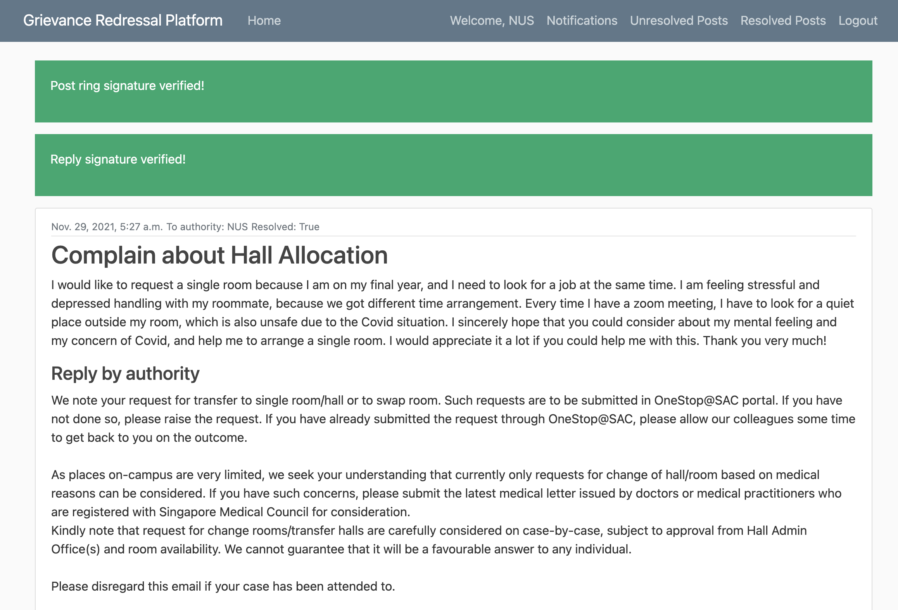
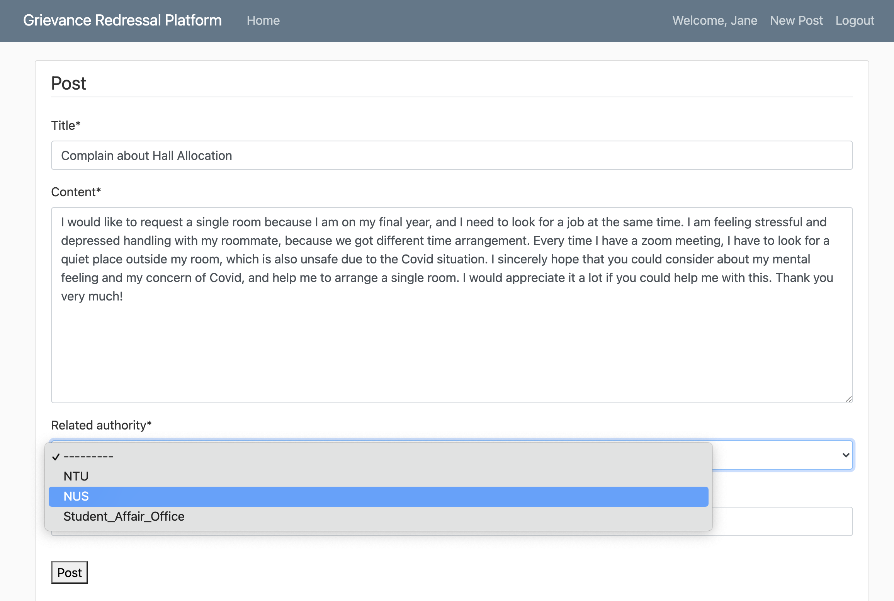

# CZ4010 Grievance Redressal Platform

## Introduction
The grievance redressal platform is a public platform that allows public members to publish their complaints to a specific authority. Authorities will be able to reply to their posts.

### If you are an authority:
1) Register yourself as an authority on the Register page.
   
2) Login through the Login page
   
3) Check for unread posts in Notifications
   
4) Check for unresolved posts
5) 
6) Reply to a post addressed to you: click on the post title to enter post details and then click reply
   
   

### If you are a public member:
1) Register yourself on the registration page.
   
2) Login through the Login page
3) Click on New Post to create a new post. Post your complaint by entering the title, content and choosing the related authority from a dropdown list.

4) Check authority's reply in the post detail.

## Data Models
1) Users (id, username, password, email, is_authority, pub_key, pri_key)
2) Post (id, author (User object), title, content, last_modified, related_authority (User object), is_read, is_resolved, reply_by_authority, post_sig, reply_sig, ring_members)

## How to run the web app

1) Clone this repo.
2) Install required packages: 
    ```angular2
    pip install -r requirements.txt
    ```
3) Run the web app on localhost using this command line:
    ```angular2
    python manage.py runserver
   ```
4) View the web app in localhost.


## References
We created the web app using Django and followed steps taught in this great [tutorial](https://www.youtube.com/watch?v=UmljXZIypDc&list=PL-osiE80TeTtoQCKZ03TU5fNfx2UY6U4p).

[Ring signature](https://courses.csail.mit.edu/6.857/2020/projects/17-Barabonkov-Esteban-Fabrega.pdf) is applied to keep anonymity and also the capability of validation at the same time.
